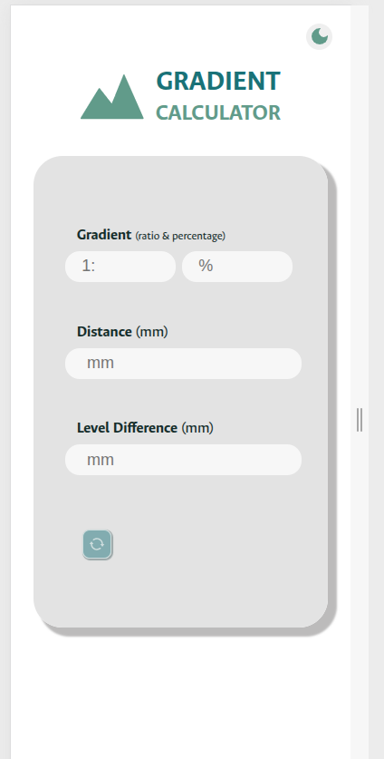
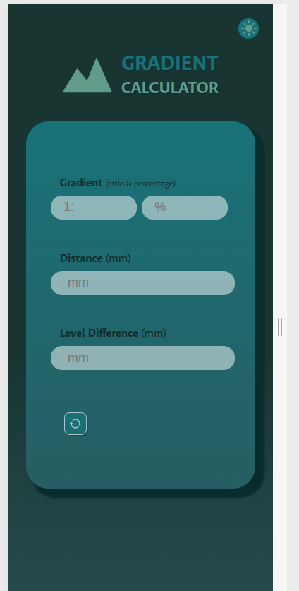

# 🌄 Gradient Calculator

The **Gradient Calculator** is a responsive web app that allows users to calculate slope/gradient using distance and level difference. It provides real-time conversion between **ratio** and **percentage** formats. It is commonly used in civil engineering, architecture, construction and road design.

## 🚀 Features

- 🧮 **Gradient Calculation** from:
  - Ratio (e.g., `1:20`)
  - Percentage (e.g., `5%`)
  - Distance and Level Difference in millimeters (mm)
- 🌗 **Dark/Light Mode Toggle**
- 🖼️ **Responsive Design** with stylized SVG graphics
- 🔄 **Reset Button** for quick input clearing

## 📸 Preview

   

## 🛠️ Technologies Used

- HTML5
- CSS3
- JavaScript

## 📁 File Structure

├── index.html # Main HTML file
├── styles.css # Custom styling
├── script.js # Calculation logic and interactivity
├── darkmode.js # Theme toggling functionality
├── README.md # You're reading it!

## 📐 How It Works

1. **Input a Gradient** as a ratio or percentage.
2. **Enter Distance and Level Difference**, and the app auto-calculates the gradient.
3. **Switch themes** using the toggle in the top-right corner.
4. **Reset values** with the circular arrow button.

## 🧠 Example Use Case

If a path has a level difference of `500mm` over a `10,000mm` distance:

- The gradient is `1:20` or `5%`.

This tool helps validate that quickly and intuitively.

## 🧾 How to Use

1. Clone or download the repository.
2. Ensure all linked files (`styles.css`, `script.js`, `darkmode.js`) are in the same directory.
3. Open `index.html` in your browser.

git clone https://github.com/catarinasapateiro/gradient-calculator.git
cd gradient-calculator
open index.html.

## 👨‍💻 Author

Developed by Catarina Sapateiro
